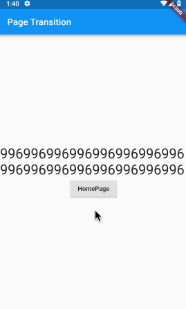
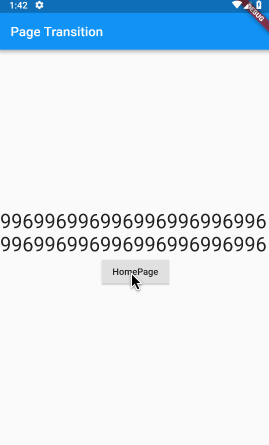
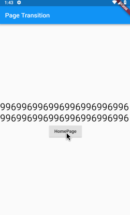
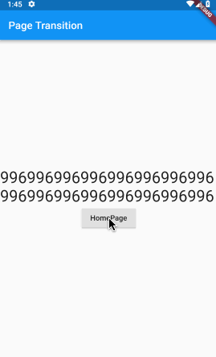
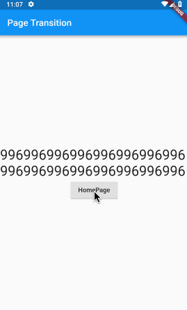
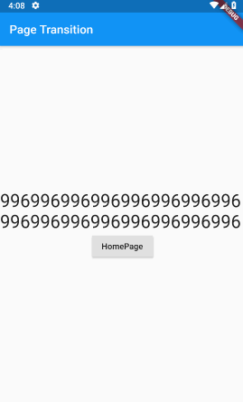

# flutter_page_transition

一个丰富、方便、易用的路由切换效果库。

[](https://pub.dev/packages/flutter_page_transition)
[](https://github.com/handoing/flutter_page_transition)
[](https://dart.dev/)
[](https://opensource.org/licenses/MIT)

[README in English](README.md)

## Some Demos









## Getting Started

pubspec.yaml中添加flutter_page_transition依赖：
```yaml
dependencies:
  flutter_page_transition: ^0.1.0
```
或者添加github仓库的依赖：
```yaml
flutter_page_transition:
  git:
    url: git://github.com/handoing/flutter_page_transition.git
```
记得执行 `flutter packages upgrade` 更新依赖。

## Transition Type

| 类型  | 方向 |
| :- | :-|
| slideInLeft | ⬅️  |
| slideInLeft | ➡️  |
| slideInUp | ⬆️  |
| slideInDown | ⬇️  |
| slideLeft | ⬅️  |
| slideRight | ➡️  |
| slideUp | ⬆️  |
| slideDown | ⬇️  |
| slideParallaxLeft | ⬅️  |
| slideParallaxRight | ➡️  |
| slideParallaxUp | ⬆️  |
| slideParallaxDown | ⬇️  |
| slideZoomLeft | ⬅️  |
| slideZoomRight | ➡️  |
| slideZoomUp | ⬆️  |
| slideZoomDown | ⬇️  |
| rippleRightUp | ↖️ |
| rippleLeftUp | ↗️  |
| rippleLeftDown | ↘️  |
| rippleRightDown | ↙️  |
| rippleMiddle | 🎆  |
| transferRight | ⬅️  |
| transferUp | ⬆️  |
| fadeIn | ❌  |
| custom | ❌  |

## Example

使用 PageRouteBuilder 组件，在 transitionsBuilder 方法里返回 effectMap 下指定类型的新组件，或者通过 Navigator push 指定的 PageTransition 组件
```dart
initialRoute: 'Home',
onGenerateRoute: (RouteSettings routeSettings){
    return new PageRouteBuilder<dynamic>(
      settings: routeSettings,
      pageBuilder: (BuildContext context, Animation<double> animation, Animation<double> secondaryAnimation) {
        switch (routeSettings.name){
          case 'Home':
            return HomePage();
          case 'Other':
            return OtherPage();
          default:
            return null;
        }
      },
      transitionDuration: const Duration(milliseconds: 300),
      transitionsBuilder: (BuildContext context, Animation<double> animation,
          Animation<double> secondaryAnimation, Widget child) {
          return effectMap[PageTransitionType.slideInLeft](Curves.linear, animation, secondaryAnimation, child);
      }
    );
}

// use Navigator
Navigator.of(context).pushNamed('Other');
// or
Navigator.of(context).push(PageTransition(type: PageTransitionType.slideInLeft, child: FirstPage()));


```

创建自定义效果:
```dart
transitionEffect.createCustomEffect(
  handle: (Curve curve, Animation<double> animation, Animation<double> secondaryAnimation, Widget child) {
    return new SlideTransition(
      position: new Tween<Offset>(
        begin: const Offset(1.0, 0.0),
        end: const Offset(0.0, 0.0),
      ).animate(CurvedAnimation(parent: animation, curve: curve)),
      child: child,
    );
  }
);

// use custom
effectMap[PageTransitionType.custom](Curves.linear, animation, secondaryAnimation, child);
```

## Test

执行 test
```bash
flutter test
```

## Test Driver

执行 driver test
```bash
cd example/
flutter drive --target=test_driver/app.dart
```

## License

[MIT](LICENSE)
